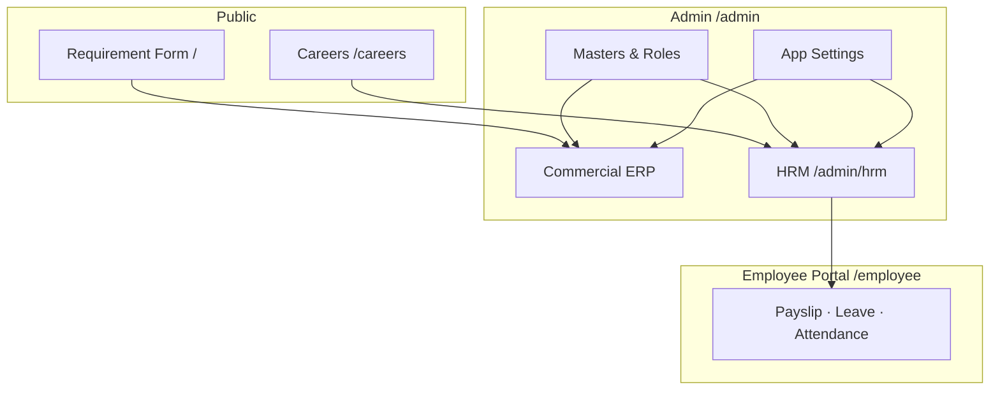

<div align="center">

# Norban Group ERP-HRM Portal

**Commercial ERP · Garments HRM/HRMS · Careers · Employee Self-Service**

Built for multi-unit RMG factories — requirement intake, 5,000+ workforce HR, ZKTeco attendance, payroll & public recruitment.

<br>

[](https://portal.norbangroup.com)
[](https://laravel.com)
[](https://php.net)
[](https://tailwindcss.com)
[](https://mysql.com)

<br>

[Live Demo](https://portal.norbangroup.com) · [HRM Blueprint](GARMENTS-HRM.md) · [Deploy Guide](DEPLOY.md)

</div>

---

## Overview

Single Laravel portal powering Norbangroup's operations — from buyer requirement submissions to full garments HR lifecycle, biometric attendance, payroll, and a public careers site.



---

## Modules

<table>
<tr>
<th>Area</th>
<th>Route</th>
<th>Highlights</th>
</tr>
<tr>
<td><strong>Commercial ERP</strong></td>
<td><code>/</code> · <code>/admin/requirements</code></td>
<td>Public requirement submission, file uploads, admin review</td>
</tr>
<tr>
<td><strong>Master Data</strong></td>
<td><code>/admin/masters</code></td>
<td>Factories, departments, designations, fabrics, trims & more</td>
</tr>
<tr>
<td><strong>Users & Roles</strong></td>
<td><code>/admin/users</code> · <code>/admin/roles</code></td>
<td>Granular permissions — <code>orders.*</code>, <code>masters.*</code>, <code>hrm.*</code></td>
</tr>
<tr>
<td><strong>HRM Admin</strong></td>
<td><code>/admin/hrm</code></td>
<td>Multi-unit RMG HRMS — see <a href="GARMENTS-HRM.md">GARMENTS-HRM.md</a></td>
</tr>
<tr>
<td><strong>Careers</strong></td>
<td><code>/careers</code></td>
<td>Job listings, online apply, OTP verification, track status</td>
</tr>
<tr>
<td><strong>Employee Portal</strong></td>
<td><code>/employee</code></td>
<td>Separate auth — payslip, leave, attendance, profile</td>
</tr>
</table>

<details>
<summary><strong>HRM sub-modules</strong> (click to expand)</summary>

<br>

| Hub | Capabilities |
|-----|--------------|
| **Employee** | Enrollment, separations, promotion/demotion, HR letters, discipline |
| **Recruitment** | Job postings, application pipeline, interviews, offer letters |
| **Attendance** | ZKTeco ADMS sync, roster, late acceptance, reports |
| **Leave** | Policies, balances, applications, maternity benefits |
| **Salary** | Grades, payroll run, increments, bank export |
| **Compliance** | Festival bonus, gratuity, statutory registers |
| **Finance** | Tax, PF, loans, final settlement |
| **RMG Extras** | Worker transfer, gate pass, manpower plan, salary hold |

</details>

---

## Quick start

### Prerequisites

PHP **8.3+** · Composer · Node.js 18+ · MySQL 8+

### Install

```bash
git clone https://github.com/shawonmisdept/norbangroup-erp.git
cd norbangroup-erp

composer install
cp .env.example .env
php artisan key:generate
php artisan migrate --seed
php artisan storage:link

npm install
npm run dev          # terminal 1
php artisan serve    # terminal 2 → http://127.0.0.1:8000
```

<table>
<tr>
<td><strong>Admin login</strong></td>
<td><code>admin@norbangroup.com</code> / <code>password</code></td>
</tr>
<tr>
<td><strong>Careers</strong></td>
<td><code>/careers</code></td>
</tr>
<tr>
<td><strong>HRM dashboard</strong></td>
<td><code>/admin/hrm</code></td>
</tr>
</table>

### Tests & background jobs

```bash
php artisan test

# optional — HRM queue worker
php artisan queue:work database --queue=hrm-sync,hrm-attendance,hrm-payroll,hrm-mail

# optional — scheduler (ADMS sync, daily alerts)
php artisan schedule:work
```

---

## Environment

```env
APP_URL=http://localhost
PORTAL_NAME="Norbangroup"

DB_CONNECTION=mysql
DB_DATABASE=order-portal

SESSION_DRIVER=database
CACHE_STORE=database
QUEUE_CONNECTION=database
FILESYSTEM_DISK=public
```

> Mail, logos, recruitment OTP/SMS, and notification toggles are managed in **Admin → App Settings**.  
> For 5,000+ employees in production, use **Redis** queues — see [DEPLOY.md](DEPLOY.md).

---

## Deployment

<details open>
<summary><strong>Shared hosting (cPanel) — step by step</strong></summary>

<br>

**1 · Clone**

```bash
git clone https://github.com/shawonmisdept/norbangroup-erp.git
cd norbangroup-erp
```

**2 · Document root** → point domain to `public/` (not project root)

**3 · Environment**

```bash
cp .env.example .env
php artisan key:generate
```

```env
APP_ENV=production
APP_DEBUG=false
APP_URL=https://portal.norbangroup.com

DB_CONNECTION=mysql
DB_HOST=localhost
DB_DATABASE=your_db
DB_USERNAME=your_user
DB_PASSWORD=your_password

SESSION_DRIVER=database
CACHE_STORE=database
QUEUE_CONNECTION=database
FILESYSTEM_DISK=public
```

**4 · Install & migrate**

```bash
composer install --no-dev --optimize-autoloader
php artisan migrate --force
php artisan storage:link
```

**5 · Cache**

```bash
php artisan config:cache
php artisan route:cache
php artisan view:cache
```

**6 · HRM checklist**

- [ ] Assign `hrm.*` permissions in **Admin → Roles**
- [ ] Configure **App Settings** (mail, logos, notifications)
- [ ] Set up queue worker + cron — [DEPLOY.md](DEPLOY.md)
- [ ] Register ZKTeco devices in **HRM Masters → Biometric Devices**

**7 · Update from Git**

```bash
git pull origin main
composer install --no-dev --optimize-autoloader
php artisan migrate --force
php artisan config:cache && php artisan route:cache && php artisan view:cache
```

</details>

<details>
<summary><strong>Frontend assets (no Node on server)</strong></summary>

<br>

Built files ship in `public/build/`. After local CSS/JS changes:

```bash
npm run build
git add public/build
git commit -m "Build frontend assets"
git push
```

</details>

---

## Tech stack

| Layer | Technology |
|-------|------------|
| Backend | Laravel 13, PHP 8.3+ |
| Frontend | Tailwind CSS v4, Alpine.js, Vite |
| Database | MySQL |
| Queue | Database (dev) · Redis (production) |
| Biometric | ZKTeco ADMS push/pull |
| Auth | Session-based admin + separate employee portal |

---

## Documentation

| Document | Description |
|----------|-------------|
| [GARMENTS-HRM.md](GARMENTS-HRM.md) | Full HRM blueprint, permissions, architecture |
| [DEPLOY.md](DEPLOY.md) | Production deploy, queue, cron, mail, ADMS |

---

## Security notes

- Never commit `.env` — contains secrets and credentials
- User uploads live in `storage/app/public/` (symlinked via `storage:link`)
- Production: keep `APP_DEBUG=false` and run `php artisan config:cache`

---

<div align="center">

<br>

**Norban Group**

*A Product of Data State Ltd*

<br>

[](https://portal.norbangroup.com)

</div>
